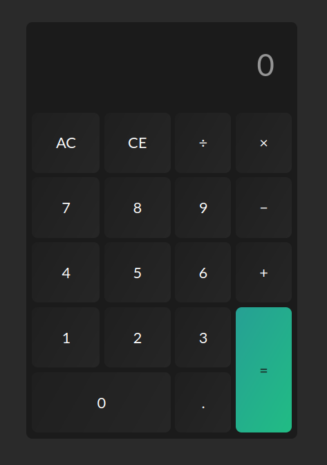

# Online Simple Calculator - RCTN Assignment 1

- Nama: Ahmad Yogi
- Program: React & React Native for Front End Developer
- Fakultas/Universitas: FKIP/Universitas Lambung Mangkurat

This is an assignment for RCTN Program from Hacktiv8 x Kampus Merdeka

# What this calculator can do?
- Add, substract, multiply and divide two numbers
- Clear the input filed with a clear button
- Can keep chaining mathematical operations together until hit the equal button, and the calculator will tell the correct output

# Interface

This project is created by __@ahmadyogi543__
